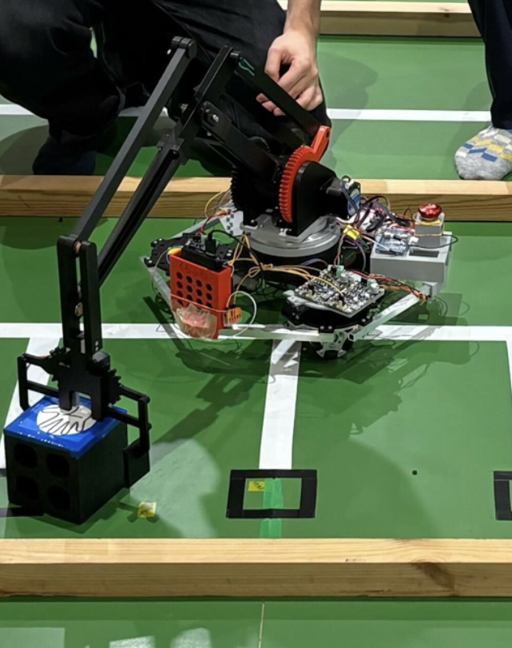
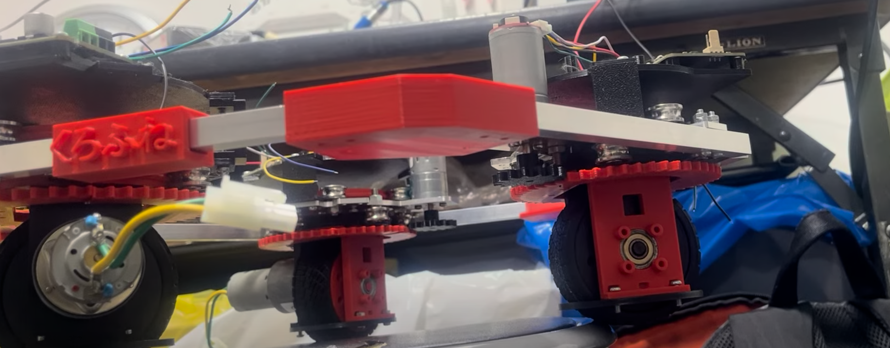
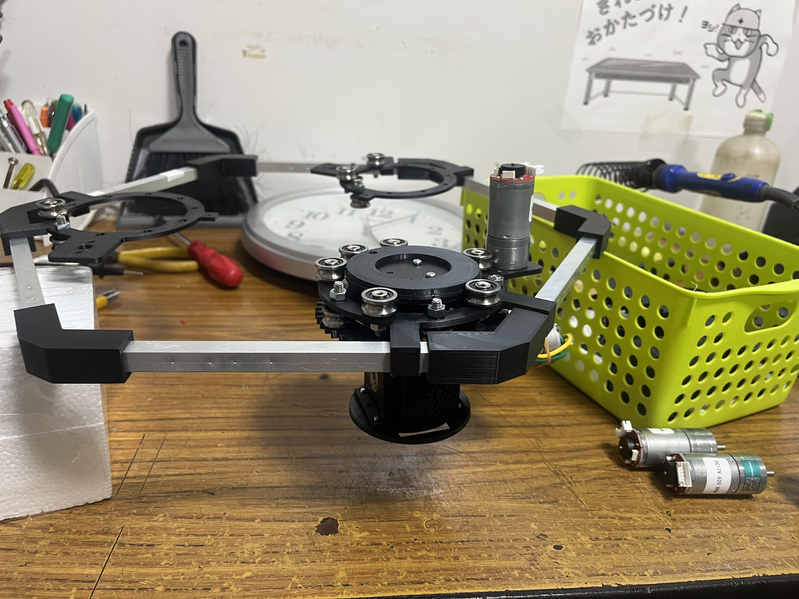
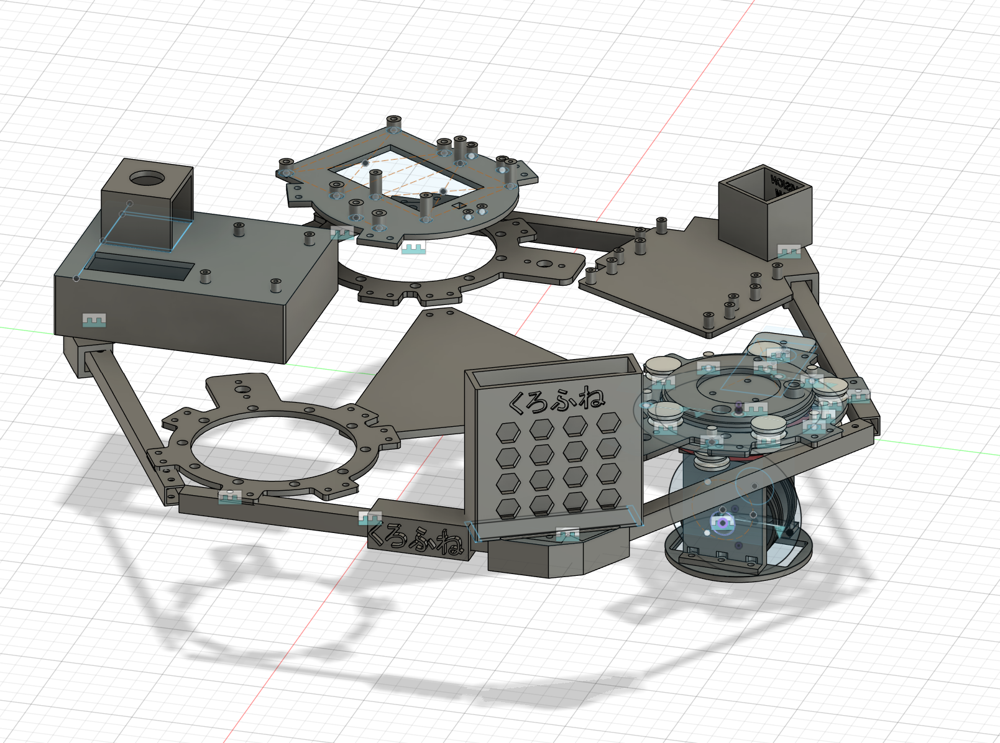
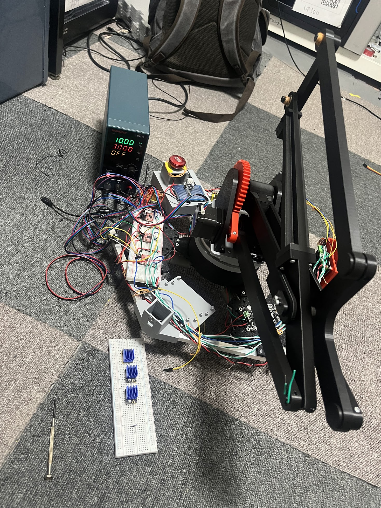

# Project overview

Perry is the robot built by team 4 in the sasori cup 2025, tokyo institute of technology, ロボット技術研究会.

The task conssited of 
1) navigation 
2) pick and place of cube objects 
3) autonomous navigation section
with different points for each section. 

I was in charge of 
1) swerve / arm / bluetooth control code
3) swerve drive design and assembly
4) circuit design and implementation

the following tasks were handled by my teammates: 
1) robot body design
2) arm design and assembly

The robot was only able to partially execute the tasks set by the competition.

## Perry

The robot consist of a 3 wheeled base, with 3 DOF arm on top. The original plan was to go for a swerve drive system, but complications near the deadline lead us to convert the project to omni wheels. the code for both implementation is reported in the repository. Each swerve module is controlled by an STM32, communicating with each other via a CAN bus. A user can give inputs through a bluetooth controller. 
The arm is a 3DOF system, with 1 motor controlling the turret and 2 motor steering the differential movements. All motors, except for the gripper, are located at the base of the arm. 

frame: 
alluminium hexagon, held together by 3d printed connectors

swerve drive system: 
one motor rotates the wheel (geared Tamiya DC motor), while the other motor (with and gear reduction) rotated the swerve module. 

 

the 3 swerve modules were positioned in the intersections of the the alluminum frame.

 

Arm: 
the arm is positioned in the middle of the robot. 

arm base: 

arm: 

due to time constraints, we switched to an omni wheel design before the tournament 
(without arm) 

(with arm)

